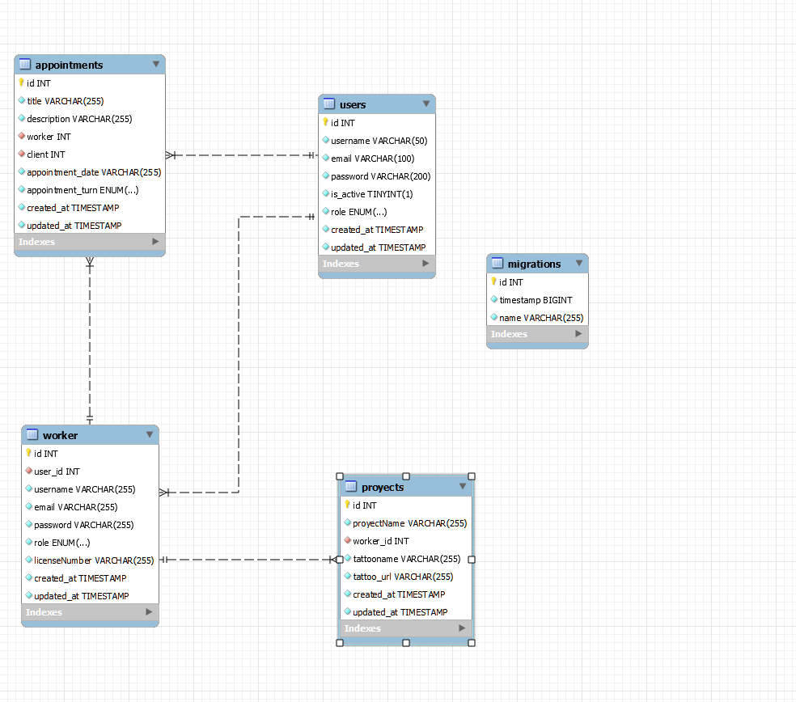

# Proyecto 4

## Tattoo Studio

Este es el cuarto proyecto del bootcamp de Full Stack Developer de la academia Geekshubs en el cual habia que hacer un backend de un sistema de gestion de citas de un estudio de tatuajes,
era necesaria una Api y tener al menos una relación entre tablas de uno a muchos y otro de muchos a muchos.

## Tecnologias utilizadas

TypeScript, node, express, typeorm, Thunderclient, Visual Studio Code and Git/Github.

## Tablas

## Instalacion en local
 
 1. Clonamos el repositorio con el comando "$ git clone [URL del repositorio]"

 2. Instalamos dependencias con el comando "$ npm install"

 3. Conectamos nuestro repositorio con nuestra base de datos, copiamos los datos del archivo ".env.example" y creamos un archivo llamado ".env" con esos mismos datos pero modificando los valores con las credenciales de nuestra base de datos.

 4. Ejecutamos las migraciones con el comando "$ npx typeorm-ts-node-commonjs migration:run -d ./src/database.ts"

5. Ejecutamos el comando "$ npm run start" para poner en marcha nuestro servidor y nuestra base de datos.

## Endpoints

 Endpoints 

- REGISTER

        POST http://localhost:3000/users/register

        body:
            {
                "username": "Psyduck",
                "email": "psyduck@gmail.com",
                "password": "psyduck"
            }

- LOGIN

    POST http://localhost:3000/users/login

    body:
        {
            "email": "goku@gmail.com",
            "password": "goku"
        }

- PROFILE

    GET http://localhost:3000/users/profile
    
    body:
        {
            "email": "Chichonicle@chichonicle.com",
            "password": "1234"
        }

- UPDATE USER

    PUT http://localhost:3000/users/update

    body:
        {
        "email": "Chichonicle@hotmail.com",
        "password": "12345"
        }

- GET ALL USERS

    GET http://localhost:3000/users/all

    (Only uper_admin)

- DELETE USER BY ID

    DELETE http://localhost:3000/users/delete

    body:

        {
            "id" : 2
        }
- CHANGE ROLE

    PUT http://localhost:3000/users/changerole

    body:

        {
            "id": "3",
            "role": "admin"
        }

- CREATE WORKER

    POST http://localhost:3000/workers/registerworker

    body:

        {
            "user_id": 5,
            "username": "Gohan",
            "email": "gohan@gmail.com",
            "password": "gohan",
            "licenseNumber": "125695478558"
        }

- CREATE APPOINTMENT

    POST http://localhost:3000/appointments/create

    body:

        {
            "title": "Tatuaje pierna",
            "description": "Tatuaje para la pierna de vegeta",
            "worker": 2,
            "client": 6,
            "date": "2023/11/20",
            "turn": "morning"
        }

- TAKE USER APPOINTMENTS

    GET http://localhost:3000/users/appointments

    body:

        {
            "id": 6
        }

- UPDATE APPOINTMENTS

    POST http://localhost:3000/appointments/update

    body:

        {
            "user_id": 6,
            "id": 1,
            "title": "Tatuaje pierna",
            "description": "Tatuaje para la pierna de gohan",
            "worker": 4,
            "client": 6,
            "date": "2023/11/18",
            "turn": "morning"
        }

- DELETE WORKER

    DELETE http://localhost:3000/workers/delete

    body:

        {
            "user_id":4,
            "id": 3
        }

- TAKE WORKER APPOINTMENTS

    GET http://localhost:3000/workers/appointments

    body:

        {
            "id": 2
        }

- GET ALL WORKERS

    GET http://localhost:3000/users/allworkers

## Contacto

 

